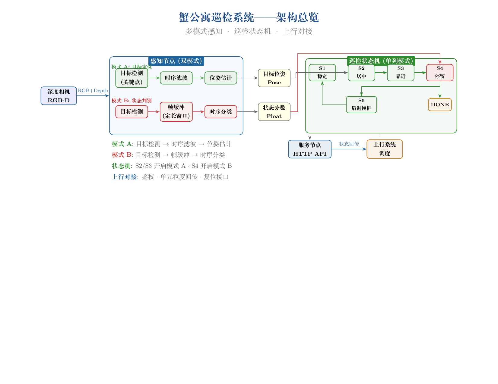
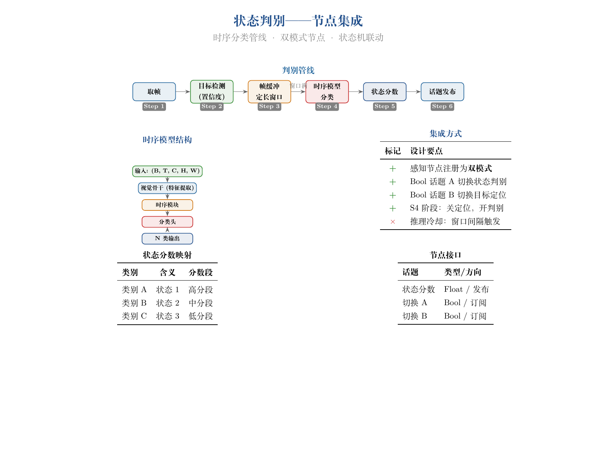
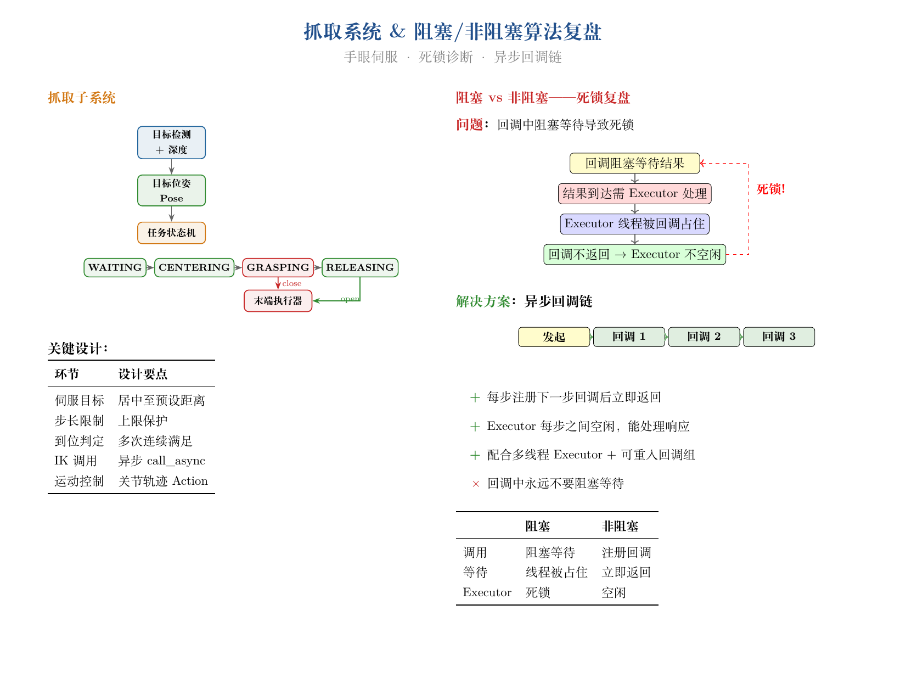

# claude-meeting-slides

**English** | [简体中文](README.zh-CN.md)

A [Claude Code](https://claude.ai/code) skill that turns your project code and progress into landscape LaTeX PDF slides — for **semi-formal technical presentations** (group meetings, weekly syncs, internal reviews).

## When to use this

✅ **Good fit** — group meetings, weekly progress reports, internal tech reviews, code walkthroughs, project updates to teammates
❌ **Not the right tool** — conference talks, thesis defenses, customer pitches. For those, hand-craft slides in Beamer, Keynote, or PowerPoint

The sweet spot is **technical accuracy + speed > visual polish**. Claude Code reads your actual source code and generates slides faithful to the implementation: TikZ architecture diagrams, state machines, parameter tables, plus room for embedded screenshots of running results.

## Example Output

A 3-page landscape PDF demo (sanitized for sharing — names, products, and parameters are placeholders):

| Page 1: System Architecture | Page 2: Node Integration | Page 3: Algorithm Retrospective |
|:---:|:---:|:---:|
|  |  |  |

> Full example in [`examples/crab-inspection/`](examples/crab-inspection/) — 3-page PDF + LaTeX source + speaker notes.

## Quick Start

### 1. Install dependencies

```bash
# Ubuntu/Debian/WSL
sudo apt install texlive-lang-chinese texlive-latex-extra texlive-fonts-recommended

# macOS (Homebrew)
brew install --cask mactex

# Windows: use WSL (recommended) with the Ubuntu command above,
#          or install MiKTeX + the ctex package
```

### 2. Add the skill to your project

```bash
# Option A: Copy the skill file into your project
cp -r .claude/ /path/to/your/project/.claude/

# Option B: Clone directly into a subdirectory and symlink
cd /path/to/your/project
ln -s /path/to/claude-meeting-slides/.claude .claude
```

### 3. Use it

In your project directory, open Claude Code and type:

```
/meeting-slides
```

Claude will ask about your reporting period, key work items, and page count, then generate the full LaTeX PDF.

## How It Works

The skill follows a 5-step workflow:

1. **Information gathering** — reads your progress notes and browses source code for accurate technical details
2. **Page planning** — proposes a page outline and gets your confirmation
3. **LaTeX writing** — generates landscape PDF with TikZ diagrams using the built-in template
4. **Compile & iterate** — compiles with `xelatex` and refines based on your feedback
5. **Speaker notes** — generates an oral script for each page

## Project Structure

```
claude-meeting-slides/
├── .claude/commands/
│   └── meeting-slides.md      ← The Claude Code skill
├── templates/
│   └── landscape-tikz.tex     ← Standalone LaTeX template (test your setup)
├── examples/
│   └── crab-inspection/       ← Full example output
├── README.md                   ← English docs
├── README.zh-CN.md             ← 中文文档
├── LICENSE                     ← MIT
└── .gitignore
```

## Test Your Setup

Compile the standalone template to verify LaTeX is working:

```bash
cd templates && xelatex landscape-tikz.tex
```

If it produces a 2-page PDF, you're good to go.

## Customization

**Colors**: Edit the `\definecolor` section in the template or skill file.

**Project-specific references**: Add reference file paths to the bottom of `.claude/commands/meeting-slides.md` so Claude knows where to find your existing reports, diagrams, or style guides.

**Output directory**: By default, output goes to `reports/meeting_YYYY_M_D/`. Edit the skill file to change this.

## Requirements

- [Claude Code CLI](https://docs.anthropic.com/en/docs/claude-code)
- TeX Live with `xelatex` + `ctex` package (for Chinese support)
- A project with source code that Claude Code can read

## License

MIT
